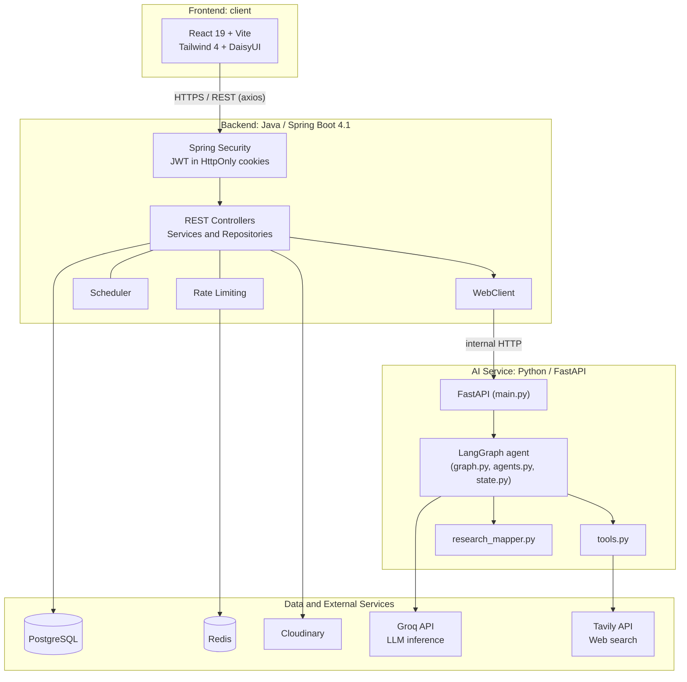

# PlaceIntel

**A placement intelligence platform for tier-3 college students** — one place for company drives, round-wise updates, prep resources, and AI-powered company research, instead of scattered WhatsApp groups and PDFs.

> Final-year engineering project, built at the intersection of traditional backend engineering and agentic AI systems.

---

## Live Demo

- **App:** `<add deployed frontend link>`

*(Free-tier hosting spins down when idle — the first request may take 30–50 seconds.)*

---

## The Problem

Placement information at tier-3 colleges is fragmented: drive announcements, eligibility criteria, interview rounds, and prep material live in chat groups, emails, and word of mouth. PlaceIntel gives colleges a structured, role-aware platform to manage placements end to end, and gives students an AI research assistant that helps them prepare for a specific company.

---

## Architecture

PlaceIntel is three independently deployable services.



### How a request flows

1. The **React client** calls the Spring Boot API with axios; the JWT travels in an **HttpOnly cookie**.
2. **Spring Security** authenticates the request, a `VerificationGateFilter` blocks unverified accounts, and **role-based access control** (ADMIN / TPO / STUDENT) authorizes it.
3. Core data (users, student profiles, companies, drives with nested rounds, resources) is served from **PostgreSQL**, with **JPA Specifications** powering filtered queries.
4. Sensitive endpoints are protected by **Redis-backed rate limiting**.
5. Image uploads go to **Cloudinary**; only the returned URL is stored in Postgres.
6. Company-research requests are forwarded by the backend (via **WebClient**) to the **AI service**, where a **LangGraph** agent uses **Groq** for reasoning and **Tavily** for live web search, and the result is mapped into a structured response the frontend renders as Markdown.

---

## Tech Stack

| Layer | Technology |
|---|---|
| Frontend | React 19, Vite, Tailwind CSS 4, DaisyUI, Framer Motion, React Router 7, Axios, react-markdown + remark-gfm, Lucide icons |
| Backend | Java 25, Spring Boot 4.1.0, Spring Web MVC, Spring Data JPA, Spring Security, Bean Validation, WebClient, Lombok |
| Auth | JWT (jjwt 0.13) in HttpOnly cookies, three-role RBAC |
| Database | PostgreSQL (UUID primary keys) |
| Cache / rate limiting | Redis (Spring Data Redis) |
| Media storage | Cloudinary |
| AI service | Python, FastAPI, Uvicorn, Pydantic, LangGraph |
| LLM and search | Groq API, Tavily API |

---

## Features

### Core platform
- **Three roles:** `ADMIN`, `TPO` (Training & Placement Officer), `STUDENT`
- **JWT auth via HttpOnly cookies** (not localStorage) to reduce XSS exposure
- **Verification gate:** unverified accounts are blocked by a custom `VerificationGateFilter`
- **Full CRUD** for Users, Student Profiles, Companies, Drives (with nested Rounds), and Resources
- **Filterable search** across drives and companies using JPA Specifications
- **Clean API contracts:** Java record DTOs, a consistent `ApiResponse` wrapper, and centralized exception handling
- **Redis-backed rate limiting** on sensitive endpoints
- **Cloudinary integration** for image uploads

### AI company research
- LangGraph agent that researches a company on demand
- Live web search through Tavily; LLM reasoning through Groq
- Research output mapped into a structured shape and rendered as Markdown in the UI

### Roadmap
- [ ] RAG over stored company data using `pgvector` and embeddings
- [ ] `<add further milestones>`

---

## Project Structure

```
placeintel/
├── client/                     # React frontend (Vite)
│   └── src/
│       ├── api/                # Axios instances and API calls
│       ├── assets/
│       ├── components/
│       ├── context/            # React context (e.g. auth state)
│       ├── pages/
│       ├── utils/
│       ├── App.jsx
│       └── main.jsx
│
├── backend/                    # Spring Boot service (com.rtx.placeintel)
│   └── src/main/java/com/rtx/placeintel/
│       ├── config/
│       ├── controller/
│       ├── dto/
│       ├── entity/
│       ├── exception/
│       ├── repository/
│       ├── scheduler/          # Scheduled jobs
│       ├── security/           # JWT, filters, RBAC
│       ├── service/
│       ├── util/
│       └── PlaceintelApplication.java
│
└── ai-service/                 # Python / FastAPI / LangGraph
    ├── main.py                 # FastAPI entry point
    ├── graph.py                # LangGraph graph definition
    ├── agents.py               # Agent nodes
    ├── state.py                # Graph state
    ├── tools.py                # Tavily search tool(s)
    ├── prompts.py              # System / task prompts
    ├── models.py               # Pydantic request/response models
    ├── research_mapper.py      # Maps raw agent output to the response schema
    ├── message_utils.py
    ├── config.py               # Settings / env loading
    ├── test_agent.py
    └── requirements.txt
```

---

## Getting Started

### Prerequisites
- Java 25 and Maven (the Maven wrapper is included)
- Node.js 18+
- Python 3.11+
- A PostgreSQL database
- A Redis instance
- A Cloudinary account
- A Groq API key and a Tavily API key

### 1. Backend
```bash
cd backend
# Configure src/main/resources/application.yml with your own values:
#   datasource (PostgreSQL), Redis, Cloudinary credentials,
#   JWT secret, and the AI service base URL
./mvnw spring-boot:run
```

### 2. AI service
```bash
cd ai-service
python -m venv venv
source venv/bin/activate        # Windows: venv\Scripts\activate
pip install -r requirements.txt
# Create a .env file with your GROQ_API_KEY and TAVILY_API_KEY
uvicorn main:app --reload --port 8000
```

### 3. Frontend
```bash
cd client
npm install
npm run dev
```

> **Never commit secrets.** `application.yml` and `.env` must be gitignored. Commit a sanitized example file instead and keep real credentials in your hosting provider's environment variables.

---

## Security Notes

- JWTs live in **HttpOnly cookies**, so client-side scripts cannot read them.
- Authorization is enforced **server-side** through Spring Security roles plus the verification gate; the client is never trusted.
- Rate limiting protects sensitive endpoints from abuse.
- The AI service is called by the backend only, so API keys for Groq and Tavily never reach the browser.

---

## Author

**Ritesh** — final-year student building at the intersection of backend engineering and agentic AI.
`<https://www.linkedin.com/in/riteshchavan2002/>`
